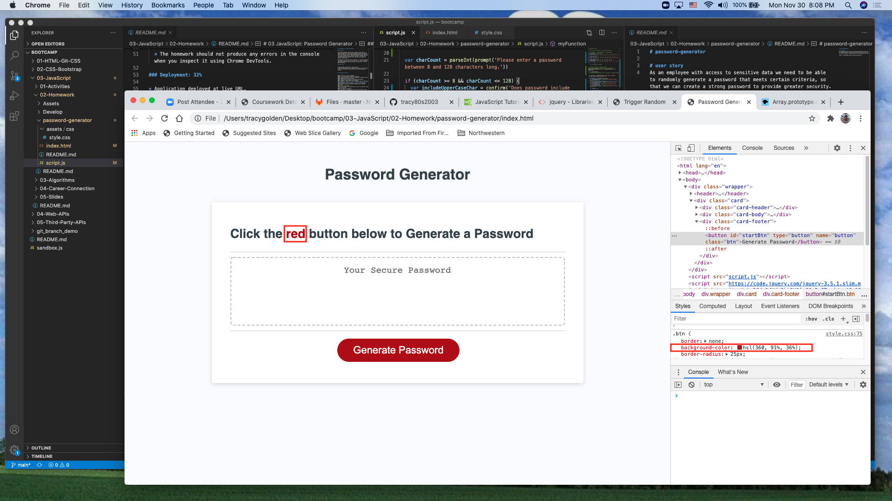

# password-generator

# User story
As an employee with access to sensitive data we need to be able to randomly generate a password that meets certain criteria, so that we can create a strong password to provide greater security.

## Rules
To obtain a random and secure password we will click the red "Generate Password" button. Next, prompts will walk us through all of the password criteria options where we can either click "Cancel" to ignore/exclude/move past that prompt or "OK" to accept/include/confirm that prompt. 

The first prompt asks to confirm choice of character length (between 8-128 characters). If number is < 8 or > 128 an alert will be shown to "Try Again." Once the length has been accepted prompts will ask to include/exclude the following criteria: uppercase letters, lowercase letters, special characters and numbers. Once through all of the prompts, a password value will be generated within the text area.

## Feature
Updated text on password generator homepage and added color to the text "red" to match the button background-color.

See snapshot:

https://tracy80s2003.github.io/password-generator/